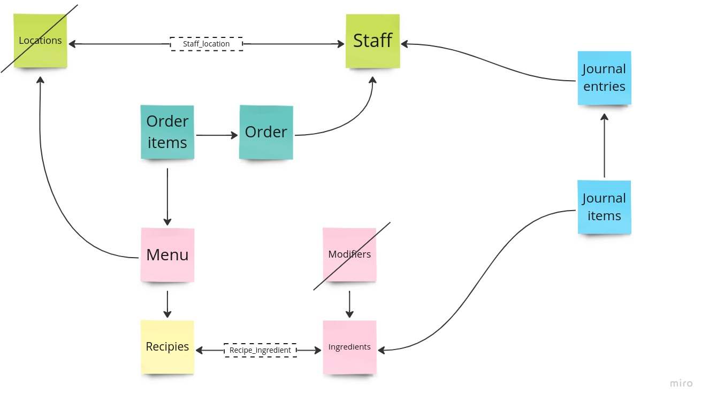

# Weird Salads inventory app

MVP application to manage inventory at Weird Salads restaurants

# Product requirements

Based on these product [requirements collected](https://nory.notion.site/Product-Engineer-Inventory-Management-Challenge-86f7d086267e4eafb8052521026293ce) from the owner of Weird Salads, we are following this product and technology analisys to provide a first MVP application that could be fully operational and allows us to learn from the final users

Each location has its own installation, Internet connection is not required neither garanteed

- 1 Local network with WiFi
- 1 PC as on-primise server connected to the local network
- N Mobile devices connected via WiFi
- N Tablet devices connected via WiFi
- WiFi network is private and only staff can use it 


# Features covered in this MVP

## Fast user login

All users needs to login into the application, so we can track all the operations that the user is performing.
We will use a 4-digit PIN code, unique per user, so the user can login very fast into the application.

## Automatic location selector

The users can only access the application in the local network of the location, so the server will take only the information.
related with its location. The users don't need to make any selection.
Really we are not managing any location, simply we are including in each database the proper information.
Manager users that belong to several locations will see the right information on each one, even though they use the same mobile device.
This can be done because each location database is independent from the others.

## POS screen

All users will place an order selecting the menu salads of the current location.
User will print the order for the customer and the order is paid.

## Kitchen screen

All user will see the pending orders
When a cooker finish the order, then can print the kitchen order to deliver the order to customer.
When printing, the order is marked as done and dissapear from the list.

## Reception screen

All user can add new ingredients deliveries.
This will create a income entry into the inventary.

## Waste screen

All user can add a waste operation, selecting the ingredients that are going to be removed from the warehouse because they are not in optimal conditions and can't be use to cook new salads. They could be spolied or dropped.

## Stock screen

All users can set the current amount of ingredients in the warehouse.
The user will count the ingredients in the warehouse, look for the ingredient in the screen and set the current amount.
These changes will allow us to measure how well are the ingredients quantities in the recepies and how well the cookers are following them. 

## Manager reports

This feature will be provided using SuperSet open-source application, installed local on-premise server
This application allows to create dashboard in one instance and import it into another instance using a ZIP file
In this video we can see how to do Import-Export operation: https://www.youtube.com/watch?v=Z808SF5rA20 (older version, but the process is similar)

Why are we using Superset? Because...:

- SuperSet is very fexible and allows us to learn which other reports the manager would need
- We need to reduce complexity, as we have limited time for this first MVP version
- Configuration can be imported in all instances

# Features out of scope of this MVP

## Users login with higher security

We are just asking a PIN code to each employee, each time the employee is using the application.
This is not secure, as the PIN could be shared/watched with other employee. So, that employee could impersonate other to 
perform the operation in the system.

Why are we selecting this method? Because...:

- This is very simple and fast for the employee to start using the appplication: "people will be performing any or all of these tasks at the same time and often under pressure"
- This is needed to record who is performing which operation
- We need to reduce complexity, as we have limited time for this first MVP version

On next iteration we could explore more secure login methods while keeping the user experience, for example:

- Biometric login, using fingerprint sensor on mobile devices
- NFC personal cards, using NFC sensor on mobile devices

## API security

API is not secured, any person with access to the private WiFi network could perform any operation against the API, using the user identifier.

Why are we let the API unsecure? Because..:

- Only some employees have access to the WiFi network
- Employees are not considered potential attackers at this phase of the project
- We need to reduce complexity, as we have limited time for this first MVP version

On next iteration we could use a Bearer token, based on the login mechanism, to make authenticated calls to the API

## Permission management and user roles

This feature is not blocking the daily operations. As we are tracking who is performing each operation
We can analyze with the owner of Weird Salads what roles can perform which operation, after we have feedback from location managers.

Why are we discarding this feature? Because...:

- This feature is not mandatory, the only requirement is that an employee only perform operations of the location it belongs to.
- We need to reduce complexity, as we have limited time for this first MVP version

On next iterations, we could:
- Allow only some operations depending on the role of the user. We could assume the role of the employees is always the same in all location
- Take into account the role of the user on each location, as it could be different.


## Kitchen management

We are asuming that we have only one person in the kitchen cooking salads, reading the orders using a mobile/tablet device and 
printing the kitchen order when all the salads included in the order are ready.
If there are more persons cooking, then they have to manage themself which order is doing each one.

Why are we discarding this feature? Because...:

- This feature is not mandatory, we could include in the future a feature to pick-up an order by a cooker.
- We need to reduce complexity, as we have limited time for this first MVP version


## Delivery management

The application is not including the restaurant table map. We are assuming that customer is taking a table by their own, like in a fast-food restaurant.
When an employee place an order, we will generate a unique order identifier and print a ticket for the customer.
These tickets are not law compliance by default. This customization is out of scope of this version.
Staff will call by the order identifier and the customer will need to show the ticket to get the food.
In ths version, we are not including any feature for make this match (customer ticket vs kitchen order)

Why are we discarding this feature? Because...:

- This feature is not mandatory, we could include in the future a feature to pair a caller device to each order, so when the order is ready, the caller is ringing.
- We need to reduce complexity, as we have limited time for this first MVP version


## Payment management

This first version doesn't include any payment helper, cash-box management nor TPV for credit cards

Why are we discarding this feature? Because...:

- This feature is not mandatory, we could include in the future a payment helper where the employee set the amount of money provided by the customer so we will show in the screen the amount of money to return to the customer. Also, a screen for managing the cash (open the box, setting initial amount of cash, conciliating the amount of cash at the end of the turn, ...). Or also, connect to a TPV device for credit card payments. 
- We need to reduce complexity, as we have limited time for this first MVP version

## Data consolidation

In this first MVP version. We are recording all the operations made in the restaurant and calculating the amount of ingredients on-the-fly.
This allows us to have granular information ready to be analyzed during time (hourly, daily, weekly, ...) and reduce the complexity.
But the performance will be impacted when we have huge amount of operations in the system.
In the future, we will be able to add a consolidation feature to replace the oldest historical data (for instance, older than a year) into a single inventory operation (like an initial balance)

## Cost and price management

We are considering that costs and prices are constant during time.
Also inventary items cost is always the same.
In a future version we should allow to set the cost to ingredients in the moment of reception, for instance based on the invoice received.
Then we have to consume ingredients (when selling, wasting or adjusting inventory) in a certain order, for instance FiFo (first in first out, to reduce waste). So, we can properly calculate the value of the inventory at any moment.

Why are we discarding this feature? Because...:

- This feature is not mandatory, prices are not changed often in a restaurant, costs could be negotiated with providers to be also constant.
- Rotation of ingredients is high, so the impact of changing costs in the database is not big in the current value of inventory.
- We need to reduce complexity, as we have limited time for this first MVP version

## Modifiers and allergens

The requirements for modifiers and allergens are not clear from product perspective. We need further research to understand how the employees are going to add additional ingredients into the customer orders

Why are we discarding this feature? Because...:
- This feature is not included in the requirements, even though the data is provided in the Excel file
- This is not blocking us to learn how this first version is working in a real scenario
- We need to reduce complexity, as we have limited time for this first MVP version

## Menus recipes

We are assuming that each menu is composed by one salad, described by one recipe.

Why are we discarding this feature? Because...:
- We need to reduce complexity, as we have limited time for this first MVP version

## Editable inventory entries

We are not supporting editions on inventory operations. Once an entry is created can't be updated or removed.

Why are we discarding this feature? Because...:

- Users can use a stock adjustment operation for fixing any human error
- We need to reduce complexity, as we have limited time for this first MVP version

## Unit conversions

This version is not managing ingredients unit conversion when receiving the Shipping.

Why are we discarding this feature? Because...:

- Users can do the conversion by their own when receiving the Shipping. Application is showing the unit expected.
- We need to reduce complexity, as we have limited time for this first MVP version

## UX improvements

There are some UX improvements that are out-of-scope of the current version, like:

- How the user selects the ingredients when receiving the Shipping. There are a huge amount of ingredients.
- Stock screen forces user to add te current stock for all the ingredients in the warehouse. In the future iteration we could show all the current ingredients in the warehouse, so the user can visually compare the quantity and make adjustments with +/- buttons

## Master data management

Master data (staff, ingredients, recipies, menus) can be managed through this MVP version.
The only way of managing it is connecting directly to database using SQL commands.


# Data model schema

We are only adding to the database the data that will be use in this MVP version.
Extra data provided will be included in future iterations, when needed.
This is specially important for people personal data. We are taking into account GDPR principle of persisting and managing always the minimum amount of data from users.



# Install instructions

## Docker installation

### Run docker-compose for application

Create a customer Docker network
```
docker network create nory-network
```

Clone project repository
```
git clone https://github.com/antespi/weird_salads.git
```

In one terminal, inside the project directory:

```
$ ./scripts/build.sh
$ ./scripts/start.sh

```

In other terminal, load initial data, then restart the first terminal

```
$ ./scripts/initial_data.sh

```

Open a browser at http://localhost:8000
PIN: 1234


If you want to reset the database (remember to restart the first terminal after it):
```
$ ./scripts/reset_db.sh
$ ./scripts/initial_data.sh

```

### Reports with SuperSet using Docker

Clone Superset repository
```
$ git clone https://github.com/apache/superset.git
```

Copy the docker compose file and add at the end the application project network 
```
$ cp cp docker-compose-non-dev.yml docker-compose-nory.yml
$ nano docker-compose-nory.yml
---
networks:
  default:
    external:
      name: nory-network
---

$ docker-compose -f docker-compose-nory.yml up
```

Open a browser at http://localhost:8088/
User: admin
Password: admin

Create a new database connection using these parameters:

- Host: 'api_db'
- Port: 5432
- Database name: weird_salads
- Username: nory
- Password: nory


## Local installation

- Install Ubuntu 22.04 LTS (jammy)
- [Install Docker](https://www.digitalocean.com/community/tutorials/how-to-install-and-use-docker-on-ubuntu-22-04)
- [Install SuperSet](https://superset.apache.org/docs/installation/installing-superset-using-docker-compose/)

- Install PostgreSQL

```
$ sudo apt update
$ sudo apt install postgresql postgresql-contrib
$ sudo systemctl start postgresql.service
$ sudo -u postgres createuser -P -s -e nory
$ sudo -u postgres createdb weird_salads

# Allow connections from Docker instances, adding the following line
$ sudo nano /etc/postgresql/14/main/pg_hba.conf
---
host    all             all             172.0.0.1/8            scram-sha-256
---

# Listen on 0.0.0.0:5432
$ sudo nano /etc/postgresql/14/main/pg_hba.conf
---
listen_addresses = '*'
---

$ sudo systemctl restart postgresql.service
```

- [Install Node](https://www.digitalocean.com/community/tutorials/how-to-install-node-js-on-ubuntu-22-04)
- Install Python

```
$ sudo apt update
$ sudo apt install python3 python3-venv libpq-dev

```

# Tests

No test included yet


# References

- [FastAPI + React template](https://github.com/evert0n/sample-fastapi-react/blob/main/README.md)
- [FastAPI tutorial](https://fastapi.tiangolo.com/es/tutorial/)
- [Dockerizing FastAPI with Postgres, Uvicorn, and Traefik](https://testdriven.io/blog/fastapi-docker-traefik/)
- [FastAPI, React and Docker](https://www.erraticbits.ca/post/2021/fastapi/)
- [Github uvicorn-gunicorn-fastapi repository](https://github.com/tiangolo/uvicorn-gunicorn-fastapi-docker)
- [DockerHub uvicorn-gunicorn-fastapi image](https://hub.docker.com/r/tiangolo/uvicorn-gunicorn-fastapi/)
- [Simple React application for a POS tutorial](https://www.youtube.com/watch?v=8E7Xwy0lXlg)
- [Simple FastAPI REST API tutorial](https://www.youtube.com/watch?v=GN6ICac3OXY)
- [How To Add Login Authentication to React Applications](https://www.digitalocean.com/community/tutorials/how-to-add-login-authentication-to-react-applications)
- [How To Use Axios with React](https://www.digitalocean.com/community/tutorials/react-axios-react)
- [How To Install and Use PostgreSQL on Ubuntu 22.04](https://www.digitalocean.com/community/tutorials/how-to-install-and-use-postgresql-on-ubuntu-22-04)
- [How to link multiple docker-compose services via network](https://tjtelan.com/blog/how-to-link-multiple-docker-compose-via-network/)

# Credits

MIT License

Logo from a image by [Konstantin Kolosov](https://pixabay.com/es/users/kkolosov-2105326/?utm_source=link-attribution&utm_medium=referral&utm_campaign=image&utm_content=1248955) at [Pixabay](https://pixabay.com/es//?utm_source=link-attribution&utm_medium=referral&utm_campaign=image&utm_content=1248955)
